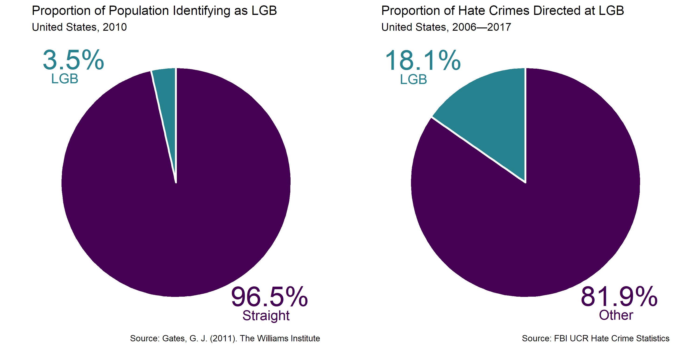
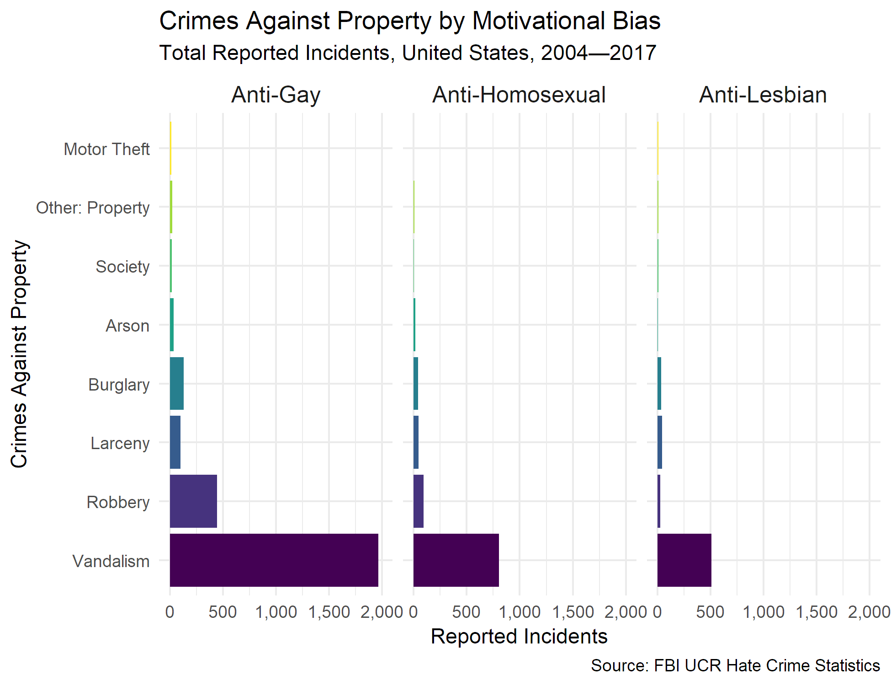

# LGBT Hate Crimes Across the U.S.
From the scandal surrounding [Jussie Smollett](https://www.nytimes.com/2019/02/23/us/jussie-smollett.html) to the [Pulse massacre in Orlando](https://www.cnn.com/2016/06/12/us/orlando-nightclub-shooting/index.html), recent memory teems with examples of hatred against the queer community. 

These two moments are far from equal; Smollett is not Orlando. As evidence mounts to discredit the *Empire* actor, it is vital to remember that hatred is real.

Resist the consideration that staging hate crimes is common. If we have learned anything from the [#MeToo movement](https://metoomvmt.org/), it is that abuse often goes unreported. Efforts to vilify victims abound.

So, before White nationalists cite Smollett as the norm, let's remember the facts.

Hate crimes target persons and property on the basis of bias against sexual, racial, religious, and gender diversity.

The U.S. Department of Justice Federal Bureau of Investigation (FBI) assembles hate crime statistics. Since the inception of the [Uniform Crime Reporting Program](https://www.fbi.gov/services/cjis/ucr) (UCR), 30,649 crimes motivated by sexual orientation were reported.

We can narrow our historical lens without losing sight of this trend. From 2006 to 2017, bias against lesbian, gay, bisexual, and transgender (LGBT) individuals motivated 16,767 hate crimes.

Over this 11-year period, hatred based on sexual orientation provoked 18.1% of reported incidents.

It is estimated that only [3.5% of U.S. adults](https://williamsinstitute.law.ucla.edu/wp-content/uploads/Gates-How-Many-People-LGBT-Apr-2011.pdf) identify as lesbian, gay, or bisexual.

Sexual minorities may not incur the most damages to persons and property from hatred-based violence. But when a hate crime occurs, nearly every fifth victim will identify as lesbian, gay, or bisexual. Given our small percentage of the total U.S. population, this disparity is disturbing.

In 2018, [Gallup reported](https://news.gallup.com/poll/234863/estimate-lgbt-population-rises.aspx) an updated estimate: 4.5% of adults identify as LGBT. One can either conclude that the LGBT population is growing or that people feel more comfortable coming out. 

In any event, bias-motivated crimes disproportionately harm lesbian women, gay men, and bisexuals.

Some years are worse than others.

Every year, at least 1,000 individuals will be harmed because of their sexual orientation.

This brief exploratory project presents geospatial, animated, and static visualizations about hate crimes affecting the LGBT community. 

# LGBT Population Estimates
While heterosexism and homophobia skew disclosures about sexual orientation, demographic evidence is growing.

Gary Gates and Abigail Cooke of The Williams Institute at UCLA [tabulated data](https://williamsinstitute.law.ucla.edu/wp-content/uploads/Census2010Snapshot-US-v2.pdf?r=1) from the 2010 U.S. Census on same-sex couples. Although these data exclude same-sex couples with concerns about confidentiality and LGBT individuals who are not in traditional monogamous relationships, the estimates unveil the concentration of queer populations across states.

The graph is unsurprising. 

Dense enclaves of sexual minorities congregate in urban centers like San Francisco, Austin, Miami, and New York City. Gay meccas have long been bastions of equality.

This heatmap does not account for single LGBT people. It is only an approximation of how queer America is.

Nonetheless, as we will see, it is a useful point of comparison.

## Comparing Populations and Hate Crimes
One would expect hate crimes to occur most frequently in homophobic states.

But reported incidents do not support this assumption.

Over the last 11 years, California reported 12,602 crimes motivated by sexual orientation. New York reported 6,976. Both states are relatively liberal. New Jersey, Michigan, and Massachusetts follow as the highest reporters of bias-motivated crime against sexual minorities.

Aside from Hawaii, which reports no data, the states with the least amount of hate crimes are Mississippi (49), Wyoming (56), and Alaska (89).

Look at two maps rendered from data in 2010.

The pattern of shading is not identical, but there does appear to be a trend: states with larger queer communities may report more hate crimes. Increased visibility may provoke bigotry and backlash.

It should be noted that the above heatmaps (animated and static) lump anti-heterosexual crimes into bias based on sexual orientation. In a moment, we will see that this lumping is negligible.

Regional norms may also affect the pattern of reporting. In more conservative, rural states, identifying as non-straight can have serious social and emotional repercussions. Consequently, individuals may delay or decline coming out. When people are less likely to come out, they are less likely to be targeted because of their sexual orientation.

Also, law enforcement officers may be reluctant to classify certain crimes as hatred-based in less liberal states. Some states, such as Georgia in 2019, lack laws punishing bias-motivated crimes. 

One may think that the price of pride is steep. Luckily, if we choose to unite as a community, the social support found in growth-fostering relationships will protect and nurture us.

# Types of Crimes Committed
Earlier, I mentioned the negligible influence of anti-heterosexual attitudes on aggregated data. This is what I mean.

Although anti-heterosexism incites *some* violence, these situations are rare. Plus, according to [ProPublica](https://www.propublica.org/article/police-are-mislabeling-crimes-as-anti-heterosexual-hate-crimes), police may erroneously classify hate crimes as anti-heterosexual.

Gay men are significantly more likely to be the victims of hate crimes. Possible reasons for this discrepancy vary. One explanation might be the interaction between two culturally condoned tendencies among men in America:

1. a pattern of policing one another's masculinity; and 
2. an externalization of anger.

The second most frequent category, anti-homosexual attitudes, could apply to men or women. 

The FBI altered how it tracks motivational biases several times over the last few decades. For example, anti-LGBT replaced anti-homosexual in 2013. Both are broad categories meant to capture the premeditated nature of bias-motivated crimes. In other words, a perpetrator might steep in contempt for the LGBT community as a whole. Whether the victim is gay or lesbian matters less than his or her violation of dominant norms.

For some people, deviance from heteronormative society is enough justification to commit a felony.

But how prevalent are these crimes?

Here is a brief example. If we trust the [Gallup poll](https://news.gallup.com/poll/234863/estimate-lgbt-population-rises.aspx), then the 2017 population of gay males in the U.S. is 3.9% of all adult males. In 2017, the [U.S. population](https://www.census.gov/popclock/) was 324,217,542. According to the [Kaiser Family Foundation](https://www.kff.org/other/state-indicator/distribution-by-gender/?currentTimeframe=0&selectedDistributions=male&selectedRows=%7B%22wrapups%22:%7B%22united-states%22:%7B%7D%7D%7D&sortModel=%7B%22colId%22:%22Location%22,%22sort%22:%22asc%22%7D), 49% of U.S. adults are male. 

So, of the 158,866,596 males in the U.S., 6,195,797 were gay in 2017. 

Using the aggregated number of incidents motivated by anti-gay attitudes (i.e., 11,314), we find that only 0.18% of gay men may incur damages at some point in their life because of their sexual orientation.

Despite this low estimate, the fear of bashing is an undeniable reality. The prevalence of hate crimes may not be large, but their occurrence is problematic.

## Crimes Against Persons
The type of crimes committed on the basis of sexual orientation tend to concentrate in a few categories.

Definitions of assault vary by state. **Simple assault** is typically an [attempt to cause harm](https://www.legalmatch.com/law-library/article/what-is-simple-assault.html) during an altercation. An **aggravated assault** is a [more serious violent contact](https://law.justia.com/codes/georgia/2010/title-16/chapter-5/article-2/16-5-21), often committed with a deadly weapon or an intent to rape, murder, or rob. **Intimidation** is the threat of bodily harm.

How do crimes against persons look within categories of motivational bias?

Gay men are most likely to be assaulted. Perpetrators intimidate and assault lesbian women with comparable frequency.

More cases of simple assault have been reported over time. A deeper analysis of this trend is warranted.

## Crimes Against Property
Bias-motivated crimes can be committed against the proporty of LGBT individuals.

The deliberate destruction of private property is an expression of hatred surpassing most forms of theft.

We can divide these crimes by the top three sexually oriented biases.

Regardless of sex, vandalism appears to be the most frequently reported crime against propoerty.

Perpetrators may steal from gay men more often. Although beyond the scope of this descriptive project, qualitative interviews with defendants might reveal a stereotypical perception that gay men are weak or affluent. 

The predominance of vandalism continued overtime.

Like other chronological trends in these data, the surge of vandalism could be due to the random variance in reporting.

## Transgender & Gender Non-Conforming
The FBI did not track crimes motivated by gender identity until 2013.

It should be noted that **Anti-Non-binary** is synonymous with **Anti-Gender Non-Conforming**. The former was used to reserve graphical real estate while the latter is employed by the FBI.

Although we lack the data, it appears that crimes motivated by gender identity plateau around 130 per year. Only [0.3% of U.S. adults](https://williamsinstitute.law.ucla.edu/wp-content/uploads/Gates-How-Many-People-LGBT-Apr-2011.pdf) identify as transgender, so perhaps the low number of incidents is an artifact of this estimate.

The breakdown by crime type is more diverse for gender identity than sexual orientation.

This wider variance is, once again, likely caused by fewer reported incidents.

Violent impulses against transgender and gender non-conforming individuals broil in ignorance.

Another explanation might lie in the validation and subsistence found in sex work. Rejection from both heterosexual and homosexual communities impedes healthy relationships between cisgender and transgender individuals. Sex work may bridge this gap. A tenth of transgender respondents reported engaging in sex work in the [National Transgender Discrimination Survey](https://www.transequality.org/sites/default/files/Meaningful%20Work-Full%20Report_FINAL_3.pdf). Given the rampant discrimination against trans-idenities in the modern workforce, sex work may also be a necessary economic activity for some individuals. Unfortunately, sex for money may increase the risk for interpersonal violence.

# Hate Crime Incidents
Hopefully these exploratory visualizations aid one's understanding of hate crimes against the LGBT community in the United States. Brief speculation has been offered to contextualize some of the patterns. This post is by no means a complete scientific analysis—consider it an active glimpse into data. 

Speaking of which, from where do these data derive?

The FBI [began tracking hate crimes](https://ucr.fbi.gov/hate-crime/2001) in response to the passage of the Hate Crime Statistics Act of 1990. The public can access reports from [1996](https://ucr.fbi.gov/hate-crime/1996) onwards. Once again, the visualizations above reflect reported incidents only. Bias-motivated crimes may be misclassified or under-reported. 

Over a decade's worth of hate crimes against LGBT persons are aggregated in this post. All data derive from **Table 13** and **Table 4**.

**Table 13**, which shows hate crime incidents according to bias motivation by state and agency, became easily downloadable in 2006.

Since the reporting practices of agencies are not uniformly encoded, only the total incidents by state per year are presented. Data in **Table 13** were missing in several instances:

1. there are no data on hate crimes in Hawaii, so an observation with zeros for all motivation biases was added for Hawaii, 2006 to 2017;
2. Mississippi was not included for the years 2006, 2007, and 2015, so observations with zeros for all motivation biases were added; and
3. New Jersey was excluded from 2012, so an observation with zeros for all motivation biases was added.

**Table 4** delineates crimes against persons and property. I extracted this information from publicly available PDFs (1996 to 2003) and Excel files (2004 to 2017). A few notes:

1. I did not have the time to manually extract the breakdown of type of crime from the pre-tabular source, so nuances are available for years after 2004;
2. crimes agaist persons included two definitions of rape in 2013 to 2016 but I collapsed these variables into one; and
3. additions (i.e., Anti-LGBT, Anti-Arab, etc.) and deletions (i.e., Anti-Homosexual) are reflected in the dataset.

The UCR did not report hate crimes on the basis of gender and gender identity until 2013. Ethnicity and race were collapsed into a single motivation bias in 2015. The aggregated data treat these two social categories as a single variable.

# Resources
If you have been the victim of a hate crime, seek immediate help.

### Report
After the incident, get medical attention and write down all the details you can remember about your assailant (i.e., gender, clothing, skin color, car type, hairstyle, etc.) and the incident (i.e., what happened, where were you, what time was it).

File a police report.

You can also report an incident anonymously to [Hate Crime Help](https://hatecrimehelp.com/).

### Support
Victims of hate crimes are [more likely](https://www.apa.org/advocacy/interpersonal-violence/hate-crimes) to suffer from post-traumatic stress, anxiety, depression, and anger. You can [find a psychology](https://locator.apa.org/) who specializes in LGBTQ Issues. There may be a LGBT-friendly [primary care physician](http://www.glma.org/) near you.

If you have began to use drugs and alcohol as a result of an incident, there are [gay-affirming substance abuse counselors](http://www.nalgap.org/) available.

If you are religious, [find an affirming Christian church](https://www.gaychurch.org/find_a_church/) near you. [PFLAG](https://pflag.org/) support groups are in most states.

Consider getting involved with the [Anti-Violence Project](https://avp.org/). Contact [LAMBDA](http://www.qrd.org/qrd/www/orgs/avproject/avp_gen.htm) or the [LGBT National Help Center](https://www.glbthotline.org/).

Be safe. Stick together. Love one another.